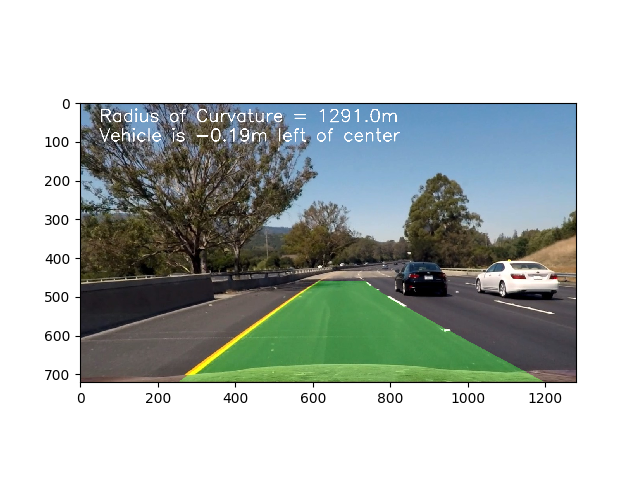

# CarND-Project4_Advanced_Lane_Lines

## Using Skill
- Computer Vision
- OpenCV

## Detail
- Built an advanced lane-finding algorithm using distortion correction, image rectification, color transforms, and gradient thresholding.
- Identified lane curvature and vehicle displacement.
- Overcame environmental challenges such as shadows and pavement changes.

